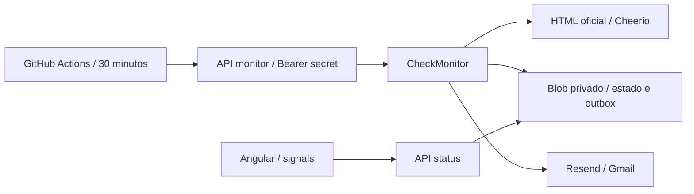

# Arquitetura

O projeto acompanha exclusivamente o Aviso 003/2026 OTT da 10ª Região Militar e avisa `antuninosantos@gmail.com` usando `onboarding@resend.dev`. A interface Angular 21 apresenta o estado real; a rotina funciona no servidor mesmo com o navegador fechado. O GitHub Actions aciona a Vercel a cada 30 minutos entre 6h e 22h de Brasília, incluindo 22h (horários aproximados).

## Mapa para leitura humana e por assistentes de programação

| Caminho | Responsabilidade |
| --- | --- |
| `src/app/app.*` | Composição da página e apresentação do status |
| `src/app/features/monitor/data-access/monitor-store.ts` | HTTP de leitura, loading, erro e signals |
| `src/app/features/monitor/ui/` | Componentes de métricas e histórico |
| `shared/monitor-status.ts` | Contrato público de leitura, sem credenciais ou conteúdo integral |
| `api/status.ts` | Consulta pública do status sanitizado |
| `api/monitor.ts` | Entrada protegida por CRON_SECRET |
| `server/domain/monitor.ts` | Modelos e portas PageSource, StateRepository, Notifier |
| `server/application/check-monitor.ts` | Caso de uso: comparar, persistir e notificar |
| `server/infrastructure/` | Adaptadores HTTP/Cheerio, Blob e Resend |
| `server/composition.ts` | Injeção explícita das dependências reais |
| `e2e/` | Fluxos de navegador desktop e mobile |

Não existe uma arquitetura universal reconhecida como a melhor para “vibe coding”. Aqui adotamos módulos por funcionalidade no frontend e portas/adaptadores no backend, com poucos níveis, nomes concretos, contratos tipados, testes próximos do código e este mapa. Isso favorece descobrir o ponto certo de alteração sem gerar camadas vazias.

## SOLID aplicado

Responsabilidade única: extração da página, armazenamento, envio e orquestração ficam separados. Aberto/fechado: outra implementação das portas pode substituir um fornecedor sem modificar o caso de uso. Substituição: adaptadores e doubles dos testes obedecem aos mesmos contratos. Segregação: três interfaces pequenas evitam um serviço genérico que concentra todas as funções. Inversão: o caso de uso depende dessas interfaces, não de Resend ou Vercel Blob.

## Fluxo

Os três crons do GitHub Actions usam UTC: `0,30 9-23 * * *`, `0,30 0 * * *` e `0 1 * * *`. Juntos equivalem a 06:00, 06:30, …, 21:30 e 22:00 em Brasília (UTC-3), sem horários agendados de madrugada. A primeira execução registra o baseline sem email. Nas próximas, SHA-256 compara o texto normalizado e os URLs absolutos ordenados da `.com-content-article__body`. Menus, scripts, estilos e espaços cosméticos não influenciam a comparação. Mudança de texto, adição/remoção de link ou alteração do destino gera um aviso.

Uma escrita condicional com ETag adquire uma lease de 120 segundos no mesmo documento de estado. Novos documentos usam `allowOverwrite: false`. Leituras usam `useCache: false`. Isso serializa workers e preserva estado entre cold starts e novos deployments; memória de Functions e `/tmp` não são usados como banco. O timeout da função é 60 segundos e o fetch é 25 segundos; uma lease expirada permite recuperação após execução interrompida.

A outbox é salva antes do envio. Cada alteração recebe um UUID utilizado como chave de idempotência Resend. A confirmação promove o novo snapshot e elimina a pendência. Falhas preservam o snapshot anterior e a pendência. Como a idempotência do Resend dura 24h, após 23h uma pendência não é reenviada automaticamente: o operador deve reconciliar o ID nos registros de envio do Resend. Isso evita duplicar um email cujo recebimento pelo fornecedor ficou ambíguo.

## Limites e operação

- O GitHub Actions verifica a cada 30 minutos, das 6h às 22h de Brasília, mas pode atrasar ou descartar execuções em períodos de carga. Após 60 dias sem atividade no repositório público, o GitHub pode desativar o agendamento. O cron diário Vercel foi removido para evitar verificações adicionais.
- São monitorados texto e links da página, não os bytes dos PDFs. Um PDF substituído no mesmo URL sem mudança no HTML pode não ser detectado.
- Email aceito pela API não garante entrega na caixa de entrada; consultar eventos do Resend e spam.
- Um HTML inesperado, indisponibilidade da fonte ou conteúdo muito curto é erro, nunca uma nova publicação.
- O painel público expõe status e diferenças do conteúdo público da página oficial. As últimas 20 detecções são preservadas separadamente das leituras sem mudanças. A chave Resend, CRON_SECRET, tokens Blob e a outbox ficam no servidor.
- Atualizar painel consulta o estado salvo; não aciona uma varredura ou envia email. O painel também consulta o status automaticamente a cada 30 segundos. As detecções mostram linhas e links adicionados/removidos, mesmo quando o envio do email falha.
- Pendência antiga: consulte o histórico do Resend usando a chave `ott-<pending.id>`. Se enviada, promova `pending.snapshot`, registre `lastEmailAt` e remova a pendência com escrita condicional. Se comprovadamente não enviada, gere uma nova identidade/data somente após essa verificação. Não edite o Blob enquanto a lease estiver ativa.

## Validação

Vitest backend verifica baseline, comparação, outbox, falhas, janela de idempotência e concorrência. TestBed + HttpTestingController verificam composição da interface e integração com o contrato HTTP. Playwright usa API local real no fluxo sem credenciais e respostas controladas para atualização/erro em desktop e mobile. Nenhum teste automatizado envia email real ou modifica o estado de produção.
